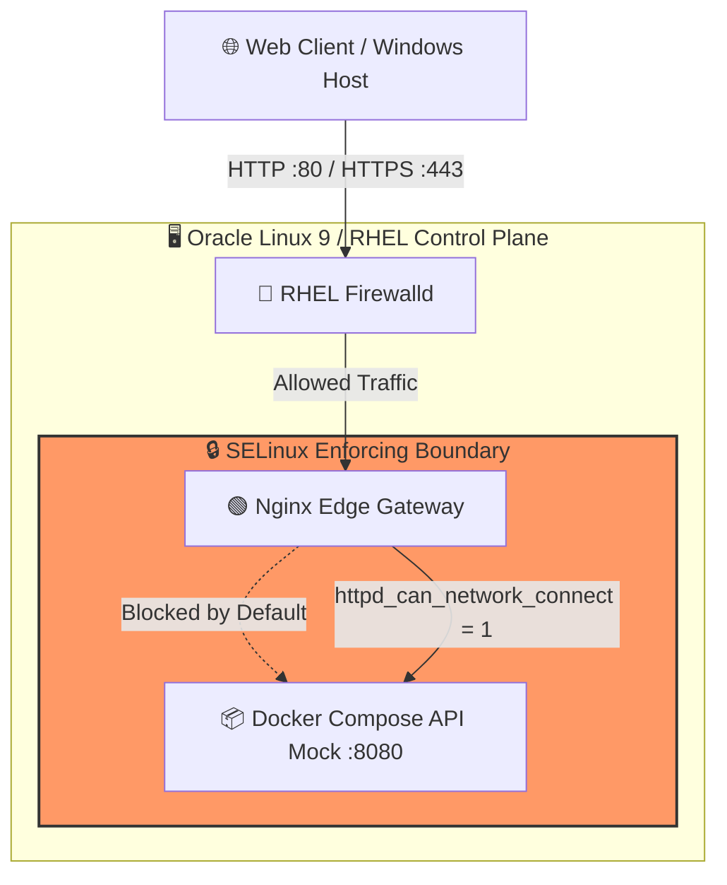
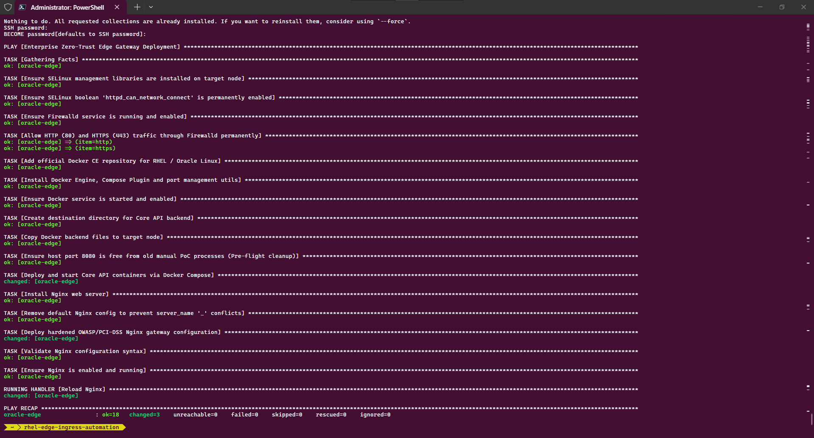
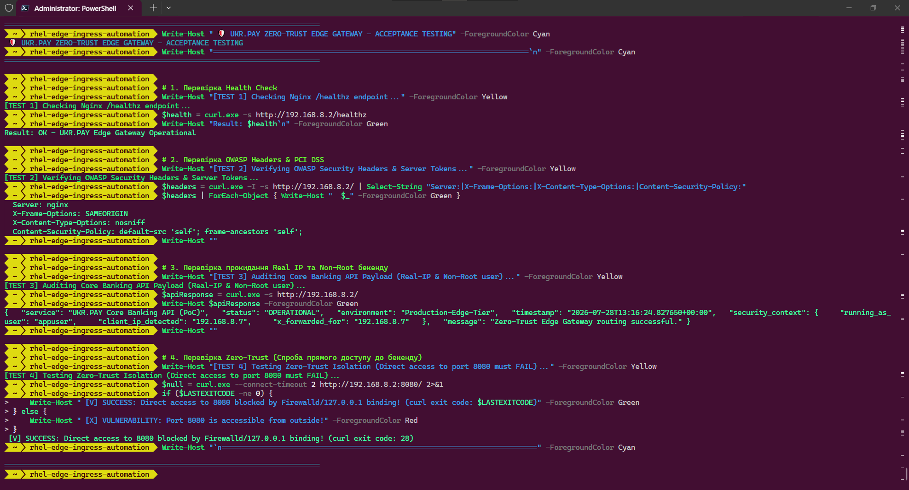

# 🛡️ RHEL Hybrid Ingress Gateway Automation (PoC)

-red?style=for-the-badge&logo=redhat)


## 📌 Executive Summary
This repository demonstrates an Enterprise-grade **Zero-Trust Edge Ingress Architecture** designed for high-security environments (FinTech / Banking). It solves the critical DevOps challenge of configuring an **Nginx Reverse Proxy** on a hardened **Red Hat Enterprise Linux (RHEL) / Oracle Linux 9** server with **SELinux in Enforcing mode** and strict **Firewalld** network policies.

## 🏗️ Architecture Diagram



## 🎯 Key Engineering Achievements
* **Zero-Trust Edge Routing:** External clients never access backend databases or microservices directly. All traffic is intercepted, inspected, and routed by the Nginx gateway.
* **SELinux Mastery:** Overcame standard `Permission Denied` proxy blocks by compiling proper SELinux booleans (`setsebool -P httpd_can_network_connect 1`) without disabling system security (`setenforce 0` is strictly prohibited).
* **Network Hardening:** Configured `firewalld` to strictly expose only Web Edge ports (`80/443`), dropping all unauthorized external packets.
* **Containerized Core Backend:** Implemented a lightweight Python API mock running as a **non-root user** inside an isolated Docker Compose network.
* **Infrastructure as Code (IaC):** Fully codified setup using modular Ansible Playbooks to guarantee idempotency and rapid disaster recovery.

## 🗂️ Repository Hierarchy
```text
rhel-edge-ingress-automation/
├── .github/workflows/          # CI/CD pipelines for linting and security scans
├── ansible/                    # IaC: Automated server provisioning
│   ├── inventory/              # Target server environments
│   ├── roles/                  # Modular roles: OS, Firewalld, Nginx, SELinux
│   └── setup-edge.yml          # Master playbook
├── docker/
│   └── backend/                # Mock FinTech Core API (Python + Docker Compose)
│       ├── Dockerfile          # Non-root container build
│       ├── api.py              # Mock JSON status endpoint
│       └── docker-compose.yml  # Backend orchestration
├── nginx/
│   └── conf.d/                 # Standardized Nginx reverse proxy routing
└── README.md
```

## 🔒 Acceptance Testing & Security Audit Results
The infrastructure has been validated using the automated QA test suite (tests/acceptance-test.ps1). Below is the verified production response from the target RHEL/Oracle Linux edge node:

### 1. Core API Security Payload (Non-root container & Real-IP routing)
```json
{
  "service": "UKR.PAY Core Banking API (PoC)",
  "status": "OPERATIONAL",
  "environment": "Production-Edge-Tier",
  "timestamp": "2026-07-28T13:16:24.827650+00:00",
  "security_context": {
    "running_as_user": "appuser",
    "client_ip_detected": "192.168.8.7",
    "x_forwarded_for": "192.168.8.7"
  },
  "message": "Zero-Trust Edge Gateway routing successful."
}
```

### 2. Defense-in-Depth Verification
* **OWASP Headers:** Verified (X-Frame-Options: SAMEORIGIN,
osniff, CSP).
* **PCI-DSS Compliance:** Server version obfuscation active (Server: nginx).
* **Network Isolation:** Direct connection attempts to backend port 8080 from external sources are actively dropped by firewalld and 127.0.0.1 binding (`curl` exit code: 28 - Connection timed out).

## 📸 Visual Evidence & Execution Logs

### 1. Ansible Idempotent Playbook Execution


Demonstrates successful execution of all **18 tasks** with **zero failures** (`ok=18 changed=3 failed=0`), covering SELinux configuration, Firewalld rules, Docker bootstrapping, and Nginx hardening.

### 2. Automated Acceptance Testing Suite


Demonstrates successful passing of all **4 verification tests**:

- Health Check
- OWASP Headers
- Non-root Real-IP audit
- Zero-Trust port isolation

---

## 👨‍💻 Author & Engineering Profile

**Leonid Lachmann**

*DevOps & Data Engineer*

- **GitHub Repository:** https://github.com/leoleiden/rhel-edge-ingress-automation

- **Tech Stack:**
  - **Operating System:** Oracle Linux 9 / Red Hat Enterprise Linux (RHEL)
  - **Web Server & Edge Ingress:** Nginx (Reverse Proxy, Upstream Keepalive, OWASP Security Headers, PCI-DSS Hardening)
  - **Containerization & Orchestration:** Docker, Docker Compose, Alpine Linux (Non-root Containers, Read-only Root Filesystem)
  - **Infrastructure as Code (IaC) & Automation:** Ansible (Idempotent Playbooks, `ansible.posix` Collection)
  - **Security & Compliance:** SELinux (Enforcing Mode), Firewalld, Zero-Trust Architecture, Network Isolation
  - **Backend Runtime:** Python 3.12 (Built-in HTTP Server, POSIX User Management)
  - **Control Plane & Tooling:** Windows 11, PowerShell, Visual Studio Code, Git, Ephemeral Containerized Workspaces
  - **Testing & Validation:** Automated PowerShell Acceptance Testing (`tests/acceptance-test.ps1`)