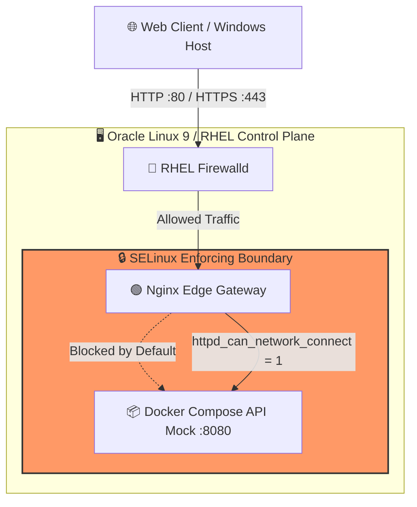

# 🛡️ RHEL Hybrid Ingress Gateway Automation (PoC)

-red?style=for-the-badge&logo=redhat)


## 📌 Executive Summary
This repository demonstrates an Enterprise-grade **Zero-Trust Edge Ingress Architecture** designed for high-security environments (FinTech / Banking). It solves the critical DevOps challenge of configuring an **Nginx Reverse Proxy** on a hardened **Red Hat Enterprise Linux (RHEL) / Oracle Linux 9** server with **SELinux in Enforcing mode** and strict **Firewalld** network policies.

## 🏗️ Architecture Diagram



## 🎯 Key Engineering Achievements
* **Zero-Trust Edge Routing:** External clients never access backend databases or microservices directly. All traffic is intercepted, inspected, and routed by the Nginx gateway.
* **SELinux Mastery:** Overcame standard `Permission Denied` proxy blocks by compiling proper SELinux booleans (`setsebool -P httpd_can_network_connect 1`) without disabling system security (`setenforce 0` is strictly prohibited).
* **Network Hardening:** Configured `firewalld` to strictly expose only Web Edge ports (`80/443`), dropping all unauthorized external packets.
* **Containerized Core Backend:** Implemented a lightweight Python API mock running as a **non-root user** inside an isolated Docker Compose network.
* **Infrastructure as Code (IaC):** Fully codified setup using modular Ansible Playbooks to guarantee idempotency and rapid disaster recovery.

## 🗂️ Repository Hierarchy
```text
rhel-edge-ingress-automation/
├── .github/workflows/          # CI/CD pipelines for linting and security scans
├── ansible/                    # IaC: Automated server provisioning
│   ├── inventory/              # Target server environments
│   ├── roles/                  # Modular roles: OS, Firewalld, Nginx, SELinux
│   └── setup-edge.yml          # Master playbook
├── docker/
│   └── backend/                # Mock FinTech Core API (Python + Docker Compose)
│       ├── Dockerfile          # Non-root container build
│       ├── api.py              # Mock JSON status endpoint
│       └── docker-compose.yml  # Backend orchestration
├── nginx/
│   └── conf.d/                 # Standardized Nginx reverse proxy routing
└── README.md
```

## 🚀 Quick Start & Verification
*(Detailed execution instructions and automated CI/CD deployment logs will be added in upcoming releases).*